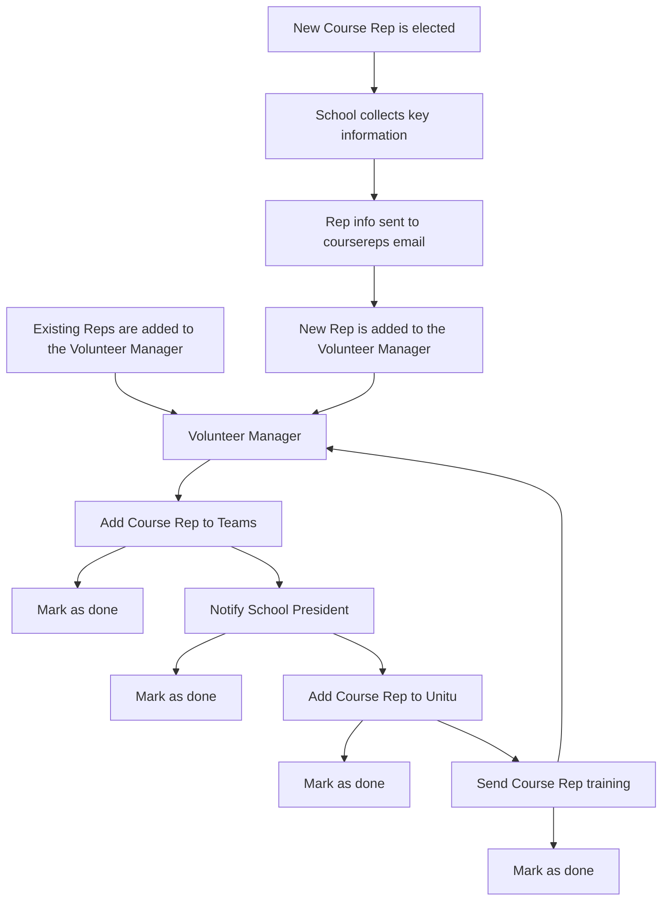

# Volunteer-Manager-Software
A software designed to manager volunteers and display analytical information for volunteer managers.

## Finalised Design
After three rounds of prototyping, a final design was approved by Steph, Krupa and Becky. 
This final design can be found on Figma [here](https://www.figma.com/design/4mGzxtmjIiOSucpNB1xUYZ/Rep-Manager?node-id=0-1&t=g4fyvHUYW3L0uUTH-0).

### Home Page
The image below shows the view of the main home page. This will be the first page that loads after opening the app. 
The intention for this page is to fill it with analytical information for us all to use. This can include figures on the number of reps elected, the number of courses represented, the number of reps who have completed training, etc.
The large grey box in the middle has been left available for a chart to fill its place, again providing analytical information.

The search bar at the tops allows you to search for a specific rep immidiately after opening the app.

### Rep Page
The rep page provides a full data view of all reps within the system. This information can be viewed in full, or it can be filtered by custom groups to find specific reps or groups of reps.
This page also allows you to manipulate the data stored within the system with the ability to add and remove reps, edit reps and group reps.

Again, search bar at the tops allows you to search for a specific rep immidiately.

#### Focused View
When on the rep page, clicking on a specific rep will open a new section with more detail pertaining to that specific rep.
This view will show all data on one rep, including thier student number, mode of study, any roles they have, and more.

### Design and Theming
For the primary/accent colour, I have used the SU orange.

For the secondary colour, I have used a light gray.

For the body I have used plain white, and for the text I have used plain black.

#### Text and Fonts
Inline with the SU branding, I have used Poppins for the font.

For the H1 font style, I have used poppins semi-bold (weight 600), size 36. 
For the H2 font style, I have used poppins semi-bold (weight 600), size 20. 
For the H3 font style, I have used poppins medium (weight 500), size 20. 
For the paragraph font style, I have used poppins regular (weight 400), size 16. 

## First Draft
Below is a first draft flowchart of how the software could run

