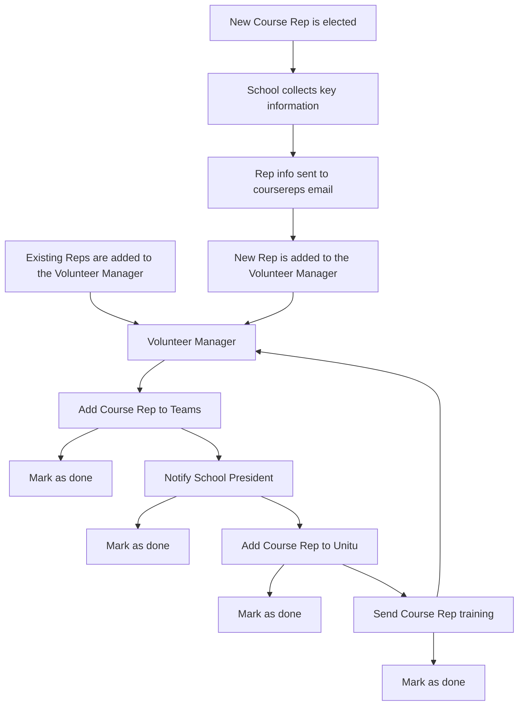

# Volunteer-Manager-Software
A software designed to manager volunteers and display analytical information for volunteer managers.

```mermaid
flowchart TD
    A[New Course Rep is elected] --> B[School collects key information];
    B --> C[Rep info sent to coursereps email];
    C --> D[New Rep is added to the Volunteer Manager];
    E[Existing Reps are added to the Volunteer Manager] --> F[Volunteer Manager];
    D --> F;
    F --> G[Add Course Rep to Teams];
    G --> H[Mark as done];
    G --> I[Notify School President];
    I --> J[Mark as done];
    I --> K[Add Course Rep to Unitu]
    K --> L[Mark as done];
    K --> M[Send Course Rep training];
    M --> N[Mark as done];
    M --> F;
```
